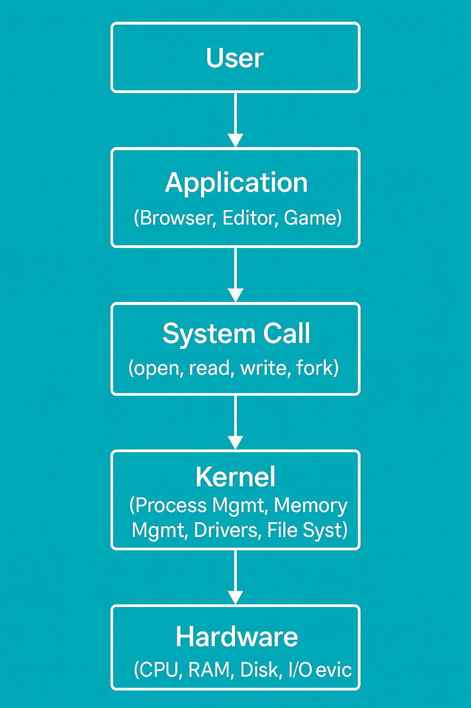

# Laporan Praktikum Minggu 1
Arsitektur Sistem Operasi dan Kernel

---

## Identitas
- **Nama**  : April Triadi
- **NIM**   : 250202930
- **Kelas** : 1IKRB

---

## Tujuan
Mahasiswa mampu menjelaskan fungsi utama sistem operasi dan peran kernel serta system call.

---

## Dasar Teori
- Mahasiswa dapat membedakan kernel mode dan user mode.
- Mempelajari perintah dasar pada linux
- Dapat menghubungkan hasil teori fungsi kernel, system call, arsitektur OS.
- 
---

## Langkah Praktikum
1. Instal Linux Ubuntu atau WSL
2. Buka WSL pada  komputer/laptop
3. Menjalankan perintah pada WSL
    ``` uname -a```, ```whoami```, ```lsmod | head```,``` dmesg | head ```.
4. Membuat diagram arsitektur os dari *Membuat diagram arsitektur yang menggambarkan alur interaksi dari *User → Application → System Call → Kernel → Hardware* menggunakan draw.io* atau menggunakan aplikasi sejenisnya.
5. Simpan hasil diagram pada ```praktikum/week1-intro-os/screenshots/diagram-os.png```.
6. Tuliskan hasil laporan pengamatan, analisi, dan kesimpulan pada ```praktikum/week1-intro-arsitektur-os/laporan.md```.
7. Simpan hasil screenshots terminal pada folder ```screenshots/```
---

## Kode / Perintah
```bash
uname -a
whoami
lsmod | head
dmesg | head
```

---

## Hasil Eksekusi
  Hasil percobaan dan digram os:
 - 
 - 

---

## Analisis
- Jelaskan makna hasil percobaan.  
- Hubungkan hasil dengan teori (fungsi kernel, system call, arsitektur OS).  
- Apa perbedaan hasil di lingkungan OS berbeda (Linux vs Windows)?  

---

## Kesimpulan
Tuliskan 2–3 poin kesimpulan dari praktikum ini.

---

## Quiz
1. Sebutkan tiga fungsi utama sitem operasi pada komputer!
- > Mengelola sumber daya komputer seperti CPU, memori, dan perangkat input-output.
- > Menyediakan antarmuka pengguna untuk berinteraksi dengan perangkat komputer.
- > Menjalankan aplikasi dan program yang diinstal oleh pengguna.

2. Jelaskan perbedaan kernel mode dan user mode !
- > Kernel mode adalah mode di mana sistem operasi bekerja dengan hak akses penuh terhadap seluruh sumber daya komputer, seperti memori, perangkat keras, dan CPU. Dalam mode ini, sistem dapat menjalankan instruksi yang bersifat kritis dan sensitif. Sebaliknya, user mode adalah mode di mana program atau aplikasi pengguna dijalankan dengan hak akses terbatas. Program di user mode tidak bisa langsung mengakses perangkat keras atau memori sistem, dan jika terjadi kesalahan, hanya program tersebut yang akan berhenti tanpa memengaruhi keseluruhan sistem.

3. Sebutkan contoh OS dengan arsitektur monolithic dan microkernel !
- > Pada arsitektur monolithic ada Linux, MS-DOS dan UNIX
- Pada microkernel ada MINIX, QNX dan Mach  

---

## Refleksi Diri
Tuliskan secara singkat:
- Apa bagian yang paling menantang minggu ini?  
- Bagaimana cara Anda mengatasinya?  

---
