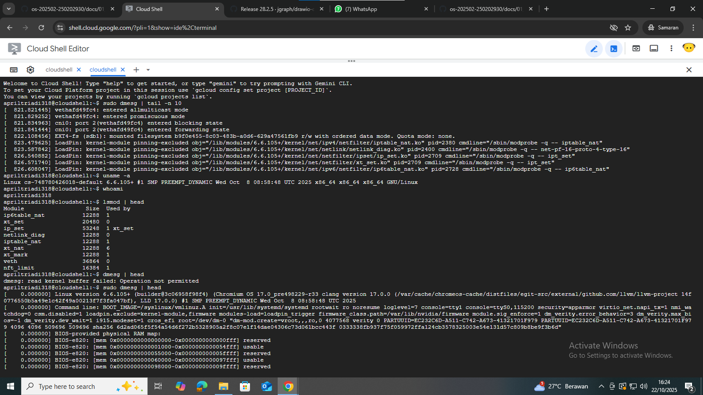

# Laporan Praktikum Minggu 1
Arsitektur Sistem Operasi dan Kernel

---

## Identitas
- **Nama**  : April Triadi
- **NIM**   : 250202930
- **Kelas** : 1IKRB

---

## Tujuan
Mahasiswa mampu menjelaskan fungsi utama sistem operasi dan peran kernel serta system call.

---

## Dasar Teori
- Mahasiswa dapat membedakan kernel mode dan user mode.
- Mempelajari perintah dasar pada linux
- Dapat menghubungkan hasil teori fungsi kernel, system call, arsitektur OS.
- 
---

## Langkah Praktikum
1. Instal Linux Ubuntu atau WSL
2. Buka WSL pada  komputer/laptop
3. Menjalankan perintah pada WSL
    ``` uname -a```, ```whoami```, ```lsmod | head```,```sudo dmesg | head ```.
4. Membuat diagram arsitektur os dari *Membuat diagram arsitektur yang menggambarkan alur interaksi dari *User → Application → System Call → Kernel → Hardware* menggunakan draw.io* atau menggunakan aplikasi sejenisnya.
5. Simpan hasil diagram pada ```praktikum/week1-intro-os/screenshots/diagram-os.png```.
6. Tuliskan hasil laporan pengamatan, analisi, dan kesimpulan pada ```praktikum/week1-intro-arsitektur-os/laporan.md```.
7. Simpan hasil screenshots terminal pada folder ```screenshots/```
---

## Kode / Perintah
```bash
uname -a
```
```
whoami
```
```
lsmod | head
```
```
sudo dmesg | head
```

---

## Hasil Eksekusi
  Hasil percobaan dan digram os:
  
  

---

## Analisis
- Jelaskan makna hasil percobaan.
  > Makna dari hasil percobaan ini bisa meliputi beberapa hal, seperti:
    - Pemahaman Fungsi Kernel: Melalui percobaan, kita dapat mengamati bagaimana kernel berinteraksi dengan perangkat keras, memanipulasi memori, mengelola proses, dan menyediakan interface bagi aplikasi.
      
    - Pengenalan terhadap System Call: Percobaan ini menunjukkan bagaimana aplikasi berinteraksi dengan kernel melalui system call untuk mendapatkan layanan yang disediakan oleh OS, seperti alokasi memori atau manajemen input/output.
    - Arsitektur OS dan Pengaruhnya: Hasil percobaan juga dapat memberikan wawasan tentang bagaimana arsitektur OS, baik berbasis monolitik atau mikrokernel, mempengaruhi performa, keandalan, dan keamanan sistem.
      
- Hubungkan hasil dengan teori (fungsi kernel, system call, arsitektur OS).
  > Hubungan dengan Teori:

Fungsi Kernel: Kernel adalah inti dari sistem operasi yang berfungsi sebagai penghubung antara perangkat keras dan perangkat lunak. Kernel mengatur semua operasi dasar seperti pengelolaan proses, manajemen memori, pengendalian perangkat I/O, dan pengelolaan sumber daya sistem. Hasil percobaan yang menunjukkan interaksi antara aplikasi dan kernel (melalui system call) memberikan gambaran tentang bagaimana kernel mengelola dan menyediakan layanan tersebut. Misalnya, jika percobaan menunjukkan perbedaan waktu eksekusi suatu aplikasi berdasarkan jumlah proses yang aktif, itu bisa mencerminkan cara kernel mengelola jadwal proses (scheduling).

System Call: System call adalah cara yang digunakan aplikasi untuk berinteraksi dengan kernel. Aplikasi meminta layanan dari kernel, seperti pembacaan atau penulisan file, alokasi memori, atau manipulasi proses. Dalam hasil percobaan, jika kita mengamati bagaimana aplikasi memanfaatkan system call untuk menjalankan tugas tertentu, itu mengungkapkan bagaimana kernel mengimplementasikan fungsi-fungsi tersebut. Misalnya, percobaan yang mengukur waktu yang dibutuhkan untuk membuka dan membaca file dapat menggambarkan seberapa efisien system call yang digunakan oleh kernel.

Arsitektur OS: Arsitektur OS adalah desain keseluruhan dari sistem operasi itu sendiri, termasuk cara komponen seperti kernel, device drivers, dan aplikasi berinteraksi. Dalam percobaan, kita bisa melihat bagaimana desain OS mempengaruhi kinerja dan efektivitas tugas-tugas sistem. Misalnya, arsitektur monolitik, di mana kernel menangani hampir semua fungsi, bisa lebih efisien dalam hal waktu respons, tetapi lebih sulit untuk diperbaiki atau ditingkatkan. Sebaliknya, arsitektur mikrokernel lebih modular, tapi bisa memiliki overhead lebih tinggi dalam hal komunikasi antar komponen.

- Apa perbedaan hasil di lingkungan OS berbeda (Linux vs Windows)?

- Kernel:

1.Linux: Kernel monolitik, lebih efisien dalam manajemen sumber daya.
2.Windows: Hybrid kernel, lebih fleksibel dalam hal kompatibilitas perangkat keras.

Manajemen Proses:

1.Linux: Penjadwalan proses lebih efisien, cocok untuk server.
2.Windows: Penjadwalan lebih interaktif, cocok untuk aplikasi desktop.

Manajemen Memori:

1.Linux: Pengelolaan memori lebih efisien, menggunakan sistem seperti Zswap.

Windows: Memori lebih boros, tetapi lebih stabil untuk aplikasi desktop.

Sistem File:

Linux: Sistem file seperti ext4 lebih cepat dalam operasi I/O.

Windows: NTFS lebih stabil untuk metadata dan pemulihan data.

Kompatibilitas Perangkat:

Linux: Lebih terbatas pada perangkat keras baru, memerlukan driver tambahan.

Windows: Kompatibilitas perangkat keras lebih baik dan lebih mudah diinstal.

Keamanan:

Linux: Lebih aman dan stabil, terutama di server.

Windows: Lebih rentan terhadap malware, meskipun sudah ada pembaruan keamanan.

Pengalaman Pengguna:

Linux: Lebih ringan di server dan sistem tanpa GUI.

Windows: Pengalaman GUI lebih ramah pengguna.

---

## Kesimpulan
Tuliskan 2–3 poin kesimpulan dari praktikum ini.

---

## Quiz
1. Sebutkan tiga fungsi utama sitem operasi pada komputer!
- > Mengelola sumber daya komputer seperti CPU, memori, dan perangkat input-output.
- > Menyediakan antarmuka pengguna untuk berinteraksi dengan perangkat komputer.
- > Menjalankan aplikasi dan program yang diinstal oleh pengguna.

2. Jelaskan perbedaan kernel mode dan user mode !
- > Kernel mode adalah mode di mana sistem operasi bekerja dengan hak akses penuh terhadap seluruh sumber daya komputer, seperti memori, perangkat keras, dan CPU. Dalam mode ini, sistem dapat menjalankan instruksi yang bersifat kritis dan sensitif. Sebaliknya, user mode adalah mode di mana program atau aplikasi pengguna dijalankan dengan hak akses terbatas. Program di user mode tidak bisa langsung mengakses perangkat keras atau memori sistem, dan jika terjadi kesalahan, hanya program tersebut yang akan berhenti tanpa memengaruhi keseluruhan sistem.

3. Sebutkan contoh OS dengan arsitektur monolithic dan microkernel !
- > Pada arsitektur monolithic ada Linux, MS-DOS dan UNIX
- > Pada microkernel ada MINIX, QNX dan Mach  

---

## Refleksi Diri
Tuliskan secara singkat:
- Apa bagian yang paling menantang minggu ini?
- > mengerjakan tugas ini menggunakan hp 
- Bagaimana cara Anda mengatasinya?
- > Dicoba saja

---
