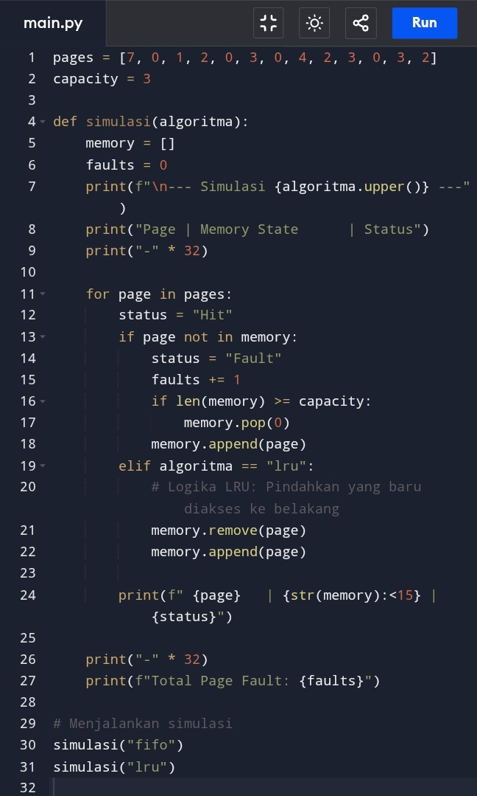
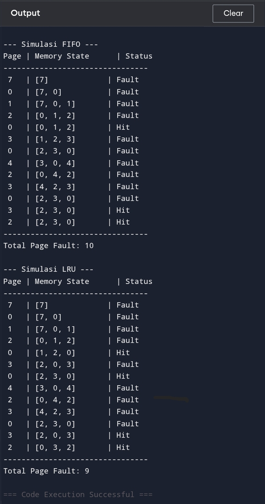

# Laporan Praktikum Minggu 10
Topik: Manajemen Memori - Page Replacement (FIFO & LRU)

---

## Identitas
- **Nama**  : April Triadi
- **NIM**   : 250202930
- **Kelas** : 1IKRB

---

## A. Deskripsi Singkat
Pada praktikum minggu ini, mahasiswa akan mempelajari **manajemen memori virtual**, khususnya mekanisme **page replacement**.  
Fokus utama praktikum adalah memahami bagaimana sistem operasi mengganti halaman (*page*) di memori utama ketika terjadi *page fault*, serta membandingkan performa algoritma **FIFO (First-In First-Out)** dan **LRU (Least Recently Used)**.

Mahasiswa akan mengimplementasikan **program simulasi page replacement**, menjalankan dataset uji, dan menyajikan hasil dalam bentuk tabel atau grafik.

---

## B. Tujuan
Setelah menyelesaikan tugas ini, mahasiswa mampu:
1. Mengimplementasikan algoritma page replacement FIFO dalam program.
2. Mengimplementasikan algoritma page replacement LRU dalam program.
3. Menjalankan simulasi page replacement dengan dataset tertentu.
4. Membandingkan performa FIFO dan LRU berdasarkan jumlah *page fault*.
5. Menyajikan hasil simulasi dalam laporan yang sistematis.

---

## C. Ketentuan Teknis
- Bahasa pemrograman **bebas** (Python / C / Java / lainnya).
- Program berbasis **terminal** (tidak wajib GUI).
- Fokus penilaian pada **logika algoritma dan keakuratan hasil simulasi**.

Struktur folder (sesuaikan dengan template repo):
```
praktikum/week10-page-replacement/
├─ code/
│  ├─ page_replacement.*
│  └─ reference_string.txt
├─ screenshots/
│  └─ hasil_simulasi.png
└─ laporan.md
```

---

## D. Langkah Pengerjaan
1. **Menyiapkan Dataset**

   Gunakan *reference string* berikut sebagai contoh:
   ```
   7, 0, 1, 2, 0, 3, 0, 4, 2, 3, 0, 3, 2
   ```
   Jumlah frame memori: **3 frame**.

2. **Implementasi FIFO**

   - Simulasikan penggantian halaman menggunakan algoritma FIFO.
   - Catat setiap *page hit* dan *page fault*.
   - Hitung total *page fault*.

3. **Implementasi LRU**

   - Simulasikan penggantian halaman menggunakan algoritma LRU.
   - Catat setiap *page hit* dan *page fault*.
   - Hitung total *page fault*.

4. **Eksekusi & Validasi**

   ### Hasil Eksekusi

   ### Output
.

5. **Analisis Perbandingan**

  | Algoritma | Jumlah Page Fault | Keterangan |
  |:--|:--|:--|
  | FIFO | 10 | Lebih sederhana namun kurang efisien.|
  | LRU | 9 | Lebih efisien karena mempertimbangkan riwayat penggunaan.|

  **Analisis:**

​Mengapa jumlah page fault berbeda?

FIFO hanya peduli pada urutan waktu masuknya halaman tanpa melihat apakah halaman tersebut sering digunakan atau tidak. Sedangkan LRU mengasumsikan bahwa halaman yang baru saja digunakan kemungkinan besar akan digunakan lagi dalam waktu dekat, sehingga ia mempertahankan halaman tersebut dan membuang yang sudah lama tidak diakses.

​Mana yang lebih efisien? 

Dalam skenario ini, LRU lebih efisien karena menghasilkan jumlah page fault yang lebih sedikit (9) dibandingkan FIFO (10). LRU cenderung bekerja lebih baik pada beban kerja nyata karena mengikuti prinsip lokalitas referensi.

6. **Commit & Push**

   ```bash
   git add .
   git commit -m "Minggu 10 - Page Replacement FIFO & LRU"
   git push origin main
   ```

---

## E. Tugas & Quiz
### Tugas
1. Buat program simulasi page replacement FIFO dan LRU.
2. Jalankan simulasi dengan dataset uji.
3. Sajikan hasil simulasi dalam tabel atau grafik.
4. Tulis laporan praktikum pada `laporan.md`.

### Quiz

Jawab pada bagian **Quiz** di laporan:

1. Apa perbedaan utama FIFO dan LRU?
Perbedaan utama terletak pada kriteria pemilihan halaman yang akan diganti (victim frame) saat terjadi page fault:
- FIFO (First-In First-Out): Menggunakan kriteria waktu masuk. Halaman yang pertama kali masuk ke memori akan menjadi yang pertama kali dikeluarkan, tanpa mempedulikan seberapa sering atau kapan terakhir kali halaman tersebut diakses.
- LRU (Least Recently Used): Menggunakan kriteria waktu penggunaan terakhir. Halaman yang sudah paling lama tidak digunakan di masa lalu akan diganti. Algoritma ini memprediksi masa depan berdasarkan perilaku masa lalu (prinsip lokalitas).

2. Mengapa FIFO dapat menghasilkan Belady’s Anomaly?
Belady’s Anomaly adalah fenomena di mana tingkat page fault justru meningkat seiring dengan bertambahnya jumlah frame memori. FIFO rentan terhadap hal ini karena:
- Agnostik terhadap frekuensi/urutan: FIFO membuang halaman hanya berdasarkan urutan kedatangannya.
Contoh Kasus: Terkadang, halaman yang masuk pertama kali adalah halaman yang sangat sering digunakan. Saat kita menambah jumlah frame, urutan penggusuran dalam FIFO bisa berubah sedemikian rupa sehingga halaman yang sangat dibutuhkan justru terus-menerus "tergusur" keluar, padahal kapasitas memori lebih besar.
- Bukan Algoritma Stack: Berbeda dengan LRU, FIFO tidak termasuk dalam kategori "algoritma stack", sehingga tidak ada jaminan bahwa set halaman pada n frame adalah subset dari halaman pada n+1 frame.

3. Mengapa LRU umumnya menghasilkan performa lebih baik dibanding FIFO?
LRU umumnya lebih unggul karena memanfaatkan prinsip Temporal Locality (Lokalitas Waktu):
- Pola Akses Data: Dalam eksekusi program yang nyata, jika sebuah data baru saja diakses, kemungkinan besar data tersebut akan diakses kembali dalam waktu dekat (misalnya dalam looping atau pemanggilan variabel).
- Efisiensi Memori: LRU berusaha menjaga halaman-halaman yang "aktif" tetap berada di memori. Dengan membuang halaman yang sudah lama tidak disentuh, LRU meminimalkan kemungkinan membuang halaman yang sebenarnya masih sangat dibutuhkan oleh CPU.
- Adaptif: Tidak seperti FIFO yang kaku pada urutan masuk, LRU beradaptasi dengan perubahan beban kerja aplikasi secara dinamis.

---

## F. Output yang Diharapkan
- Kode program simulasi di folder `code/`.
- Dataset uji di `code/reference_string.txt`.
- Screenshot hasil simulasi di `screenshots/`.
- Laporan lengkap di `laporan.md`.
- Semua hasil telah di-*commit* ke GitHub.

---

## G. Referensi
1. Silberschatz, A., Galvin, P., Gagne, G. *Operating System Concepts*, 10th Ed.
2. Tanenbaum, A. *Modern Operating Systems*, 4th Ed.
3. OSTEP – Virtual Memory & Page Replacement.
