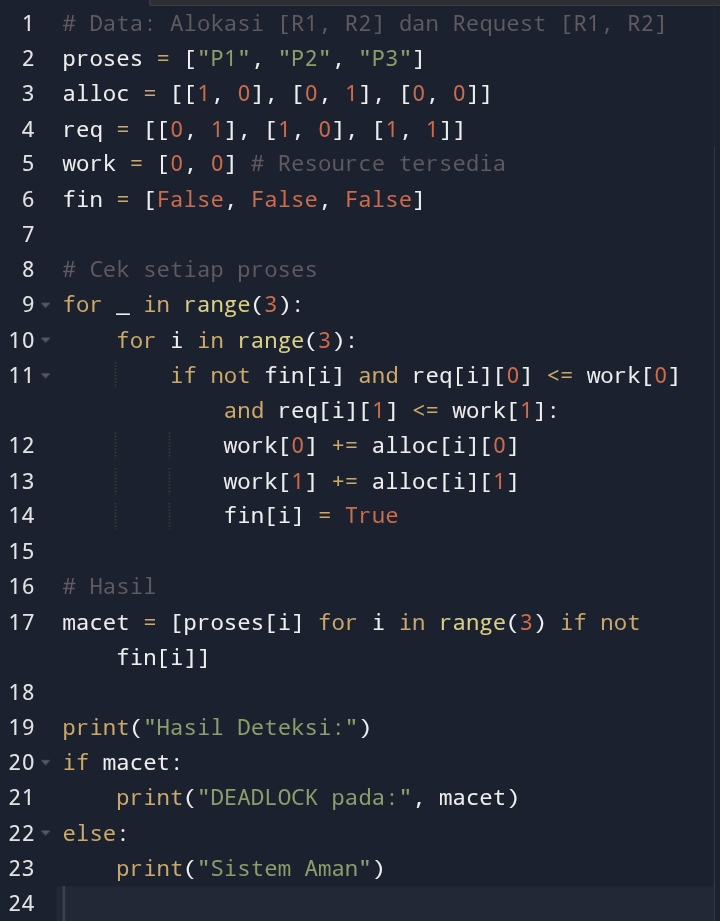
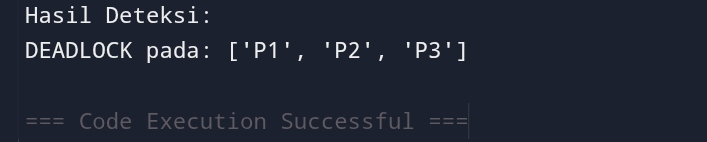

# Laporan Praktikum Minggu 11
Topik: Simulasi dan Deteksi Deadlock
---

## Identitas
- **Nama**  : April Triadi
- **NIM**   : 250202930
- **Kelas** : 1IKRB

---

## Tujuan
Tuliskan tujuan praktikum minggu ini.  
Agar tahu cara komputer mendeteksi aplikasi yang macet (deadlock) dengan melihat siapa yang bawa barang (resource) dan siapa yang lagi minta barang, lalu membuktikan kemacetan itu lewat hitungan algoritma.

​Ringkasnya ada 2 poin:

• ​Praktik: Bisa bikin program pengawas untuk cek apakah sistem lagi "skakmat" atau aman.

• ​Analisis: Paham kenapa sistem bisa macet (karena saling tunggu barang yang sama).

---

## Dasar Teori
​1. Kondisi "Saling Tunggu" (Circular Wait)

​Teori utamanya adalah Circular Wait. Ini kondisi di mana proses-proses di komputer membentuk lingkaran "antrean macet".

• ​A nunggu B.

• ​B nunggu C.

• ​C nunggu A.

• ​Hasil: Semuanya berhenti total (Deadlock).

​2. Algoritma Deteksi

​Teorinya menggunakan cara "Simulasi Penyelesaian":

• ​Program mengecek: "Ada nggak proses yang bisa selesai dengan sisa barang (resource) yang ada?"

• ​Kalau ada, proses itu dianggap selesai, lalu barangnya dikembalikan ke gudang.

• ​Cek lagi proses sisanya. Kalau sampai akhir ada yang tetap tidak bisa jalan, berarti secara teori mereka sedang Deadlock.

​Ringkasnya: Teorinya adalah memantau siapa pegang apa dan siapa minta apa, lalu hitung apakah ada jalan keluarnya atau tidak.

---

## Langkah Praktikum
Tuliskan potongan kode atau perintah utama:
1. **Menyiapkan Dataset**

   Gunakan dataset sederhana yang berisi:
   - Daftar proses  
   - Resource Allocation  
   - Resource Request / Need

   Contoh tabel:

   | Proses | Allocation | Request |
   |:--:|:--:|:--:|
   | P1 | R1 | R2 |
   | P2 | R2 | R3 |
   | P3 | R3 | R1 |

2. **Implementasi Algoritma Deteksi Deadlock**

   Program minimal harus:
   - Membaca data proses dan resource.  
   - Menentukan apakah sistem berada dalam kondisi deadlock.  
   - Menampilkan proses mana saja yang terlibat deadlock.

3. **Eksekusi & Validasi**

   - Jalankan program dengan dataset uji.  
   - Validasi hasil deteksi dengan analisis manual/logis.  
   - Simpan hasil eksekusi dalam bentuk screenshot.

4. **Analisis Hasil**

   - Sajikan hasil deteksi dalam tabel (proses deadlock / tidak).  
   - Jelaskan mengapa deadlock terjadi atau tidak terjadi.  
   - Kaitkan hasil dengan teori deadlock (empat kondisi).

5. **Commit & Push**

   ```bash
   git add .
   git commit -m "Minggu 11 - Deadlock Detection"
   git push origin main
   ```

---

## Hasil Eksekusi
Sertakan screenshot hasil percobaan atau diagram:

Output:


---

## Analisis
​1. Tabel Hasil Deteksi
​Berdasarkan program yang dijalankan dengan dataset yang diberikan, berikut adalah status setiap proses.
|Proses|Status|Keterangan|
|---|---|---|
P1|Deadlock|Menunggu Resource 2 (R2) yang dibawa P2
|P2|Deadlock|Menunggu Resource 1 (R1) yang dibawa P1
|P3|Deadlock|Menunggu R1 dan R2 yang sedang tertahan|

2. Mengapa Deadlock Terjadi?

​Deadlock terjadi karena sistem kehabisan sumber daya yang bebas (Available = 0), sementara proses-proses yang ada tidak mau melepaskan sumber daya yang sudah mereka genggam sebelum permintaan mereka terpenuhi.

​P1 memegang R1 namun meminta R2, di sisi lain P2 memegang R2 namun meminta R1. Keduanya terkunci dalam aksi "saling menunggu" tanpa ada yang bisa selesai lebih dulu. Karena P1 dan P2 macet, P3 yang juga butuh resource tersebut ikut macet.

​3. Kaitan dengan Teori (4 Kondisi Deadlock)

​Hasil simulasi ini membuktikan bahwa deadlock terjadi karena terpenuhinya empat kondisi Coffman:

• ​Mutual Exclusion: Resource R1 dan R2 hanya bisa digunakan oleh satu proses pada satu waktu (tidak bisa dipakai barengan).

• ​Hold and Wait: P1 memegang R1 (Hold) sambil menunggu R2 (Wait). Begitu juga dengan P2.

• ​No Preemption: Sistem tidak bisa memaksa P1 untuk menyerahkan R1-nya kepada P2 secara paksa.

• ​Circular Wait: Terjadi rantai melingkar. P1 menunggu P2, dan P2 menunggu P1. Inilah penyebab utama sistem "skakmat".

---

## Kesimpulan
Kesimpulan dari praktikum ini adalah:

• ​Deadlock Terjadi karena Saling Menunggu: Sistem mengalami kemacetan total jika proses-proses saling memegang sumber daya (resource) yang dibutuhkan oleh proses lain tanpa ada yang mau mengalah (Circular Wait).

• ​Deteksi adalah Solusi Akhir: Jika kemacetan tidak bisa dicegah dari awal, maka sistem harus memiliki mekanisme deteksi (seperti program yang kamu buat) untuk mengidentifikasi proses mana saja yang macet agar bisa diambil tindakan.

• ​Kondisi Skakmat: Deadlock terbukti terjadi saat sumber daya yang tersedia (Available) tidak lagi cukup untuk memenuhi permintaan (Request) dari proses-proses yang masih berjalan.

​Singkatnya: Praktikum ini membuktikan bahwa tanpa pengelolaan resource yang baik, sistem akan berhenti bekerja akibat lingkaran saling tunggu antar proses.

---

## Quiz
​1. Apa perbedaan antara deadlock prevention, avoidance, dan detection?

• ​Prevention (Pencegahan): Membuat aturan super ketat sejak awal supaya 4 syarat deadlock tidak pernah terpenuhi (sistem jadi sangat kaku).

• ​Avoidance (Penghindaran): Sistem selalu mengecek setiap ada permintaan resource. Jika dianggap tidak aman, permintaan ditunda (seperti lampu merah yang mengatur jalan).

• ​Detection (Deteksi): Sistem membiarkan semua berjalan apa adanya, lalu sesekali mengecek apakah sudah terjadi macet atau tidak (seperti polisi yang datang setelah ada tabrakan).

​2. Mengapa deteksi deadlock tetap diperlukan dalam sistem operasi?

Karena metode pencegahan (prevention) dan penghindaran (avoidance) seringkali memakan banyak waktu dan membuat penggunaan resource jadi boros/tidak maksimal. Deteksi diperlukan agar komputer bisa bekerja secepat mungkin, dan baru bertindak hanya saat benar-benar terjadi masalah.

​3. Apa kelebihan dan kekurangan pendekatan deteksi deadlock?

• ​Kelebihan: Penggunaan resource lebih maksimal dan efisien karena tidak banyak dibatasi di awal.

• ​Kekurangan: Ada beban kerja tambahan (overhead) bagi komputer untuk menjalankan algoritma deteksi secara terus-menerus, dan ada risiko data rusak jika proses diputus paksa saat terjadi deadlock.

---

## Refleksi Diri
​Apa bagian yang paling menantang minggu ini?

Bagian paling menantang adalah memahami logika Circular Wait dalam algoritma deteksi deadlock, yaitu bagaimana cara program menentukan secara otomatis bahwa beberapa proses sedang terjebak dalam lingkaran "saling menunggu" resource yang tidak kunjung selesai.

​Bagaimana cara Anda mengatasinya?

Saya mengatasinya dengan membuat simulasi sederhana menggunakan kode Python untuk melacak alokasi dan permintaan resource. Selain itu, saya menggunakan perumpamaan dunia nyata (seperti kasus "Andi dan Budi" yang berebut alat makan) untuk mempermudah visualisasi alur kerja algoritmanya.

---

**Credit:**  
_Template laporan praktikum Sistem Operasi (SO-202501) – Universitas Putra Bangsa_
