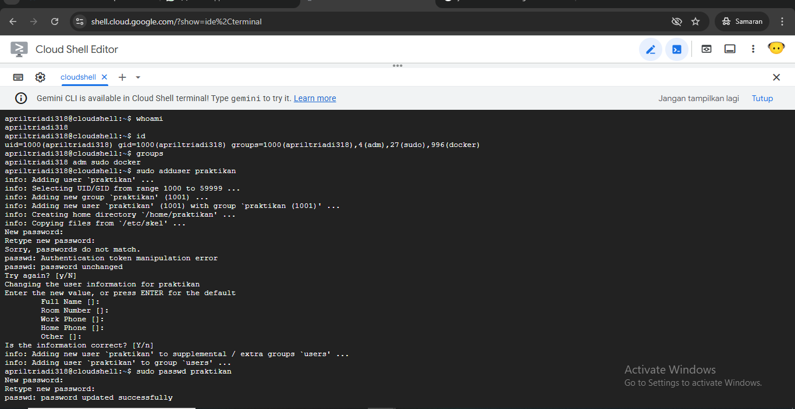
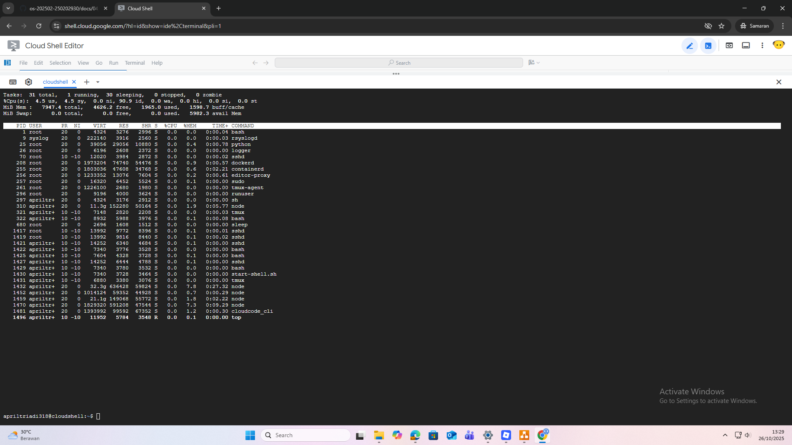
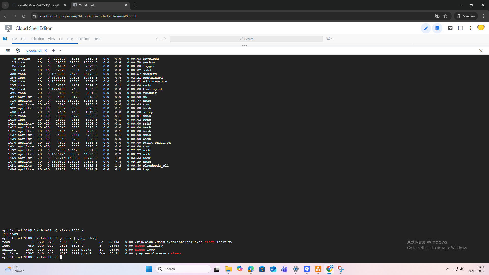
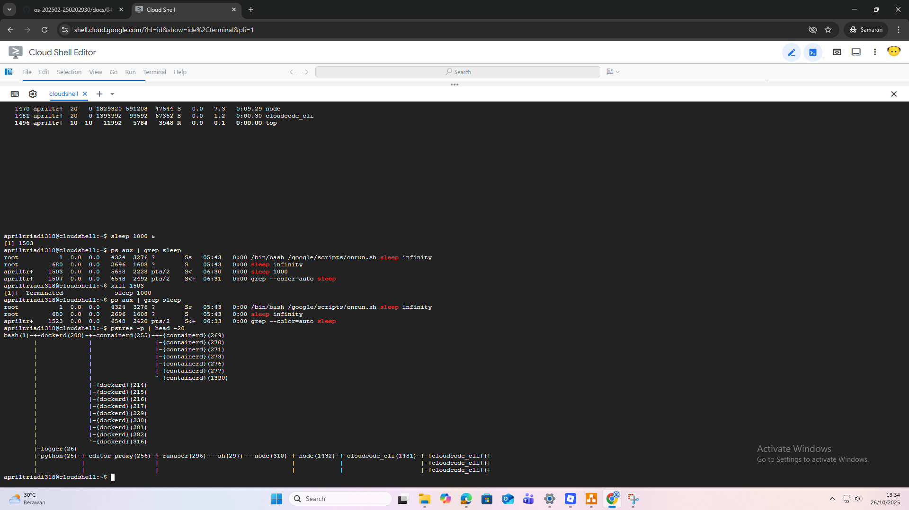

# Laporan Praktikum Minggu 4
Topik: Manajemen Proses dan User di Linux

---

## Identitas
- **Nama**  : April Triadi
- **NIM**   : 250202930
- **Kelas** : 1IKRB

---

## Tujuan
Setelah menyelesaikan tugas ini, mahasiswa mampu:
1. Menjelaskan konsep proses dan user dalam sistem operasi Linux.  
2. Menampilkan daftar proses yang sedang berjalan dan statusnya.  
3. Menggunakan perintah untuk membuat dan mengelola user.  
4. Menghentikan atau mengontrol proses tertentu menggunakan PID.  
5. Menjelaskan kaitan antara manajemen user dan keamanan sistem.  
---

## Dasar Teori
Pada praktikum minggu ini, mahasiswa akan mempelajari **konsep proses dan manajemen user dalam sistem operasi Linux.**  
Mahasiswa akan memahami bagaimana sistem operasi:
- Membuat dan mengatur proses (process management).  
- Mengelola user, group, serta hak akses pengguna.  
- Menampilkan, menghentikan, dan mengontrol proses yang sedang berjalan.  
- Menghubungkan konsep user management dengan keamanan sistem operasi.

Eksperimen dilakukan melalui penggunaan perintah dasar seperti `ps`, `top`, `kill`, `adduser`, `passwd`, `id`, dan `groups`.

---

## Langkah Praktikum
1. **Setup Environment**
   - Gunakan Linux (Ubuntu/WSL).  
   - Pastikan Anda sudah login sebagai user non-root.  
   - Siapkan folder kerja:
     ```
     praktikum/week4-proses-user/
     ```

2. **Eksperimen 1 – Identitas User**
   Jalankan perintah berikut:
   ```bash
   whoami
   id
   groups
   ```
   - Jelaskan setiap output dan fungsinya.  
   - Buat user baru (jika memiliki izin sudo):
     ```bash
     sudo adduser praktikan
     sudo passwd praktikan
     ```
   - Uji login ke user baru.

3. **Eksperimen 2 – Monitoring Proses**
   Jalankan:
   ```bash
   ps aux | head -10
   top -n 1
   ```
   - Jelaskan kolom penting seperti PID, USER, %CPU, %MEM, COMMAND.  
   - Simpan tangkapan layar `top` ke:
     ```
     praktikum/week4-proses-user/screenshots/top.png
     ```

4. **Eksperimen 3 – Kontrol Proses**
   - Jalankan program latar belakang:
     ```bash
     sleep 1000 &
     ps aux | grep sleep
     ```
   - Catat PID proses `sleep`.  
   - Hentikan proses:
     ```bash
     kill <PID>
     ```
   - Pastikan proses telah berhenti dengan `ps aux | grep sleep`.

5. **Eksperimen 4 – Analisis Hierarki Proses**
   Jalankan:
   ```bash
   pstree -p | head -20
   ```
   - Amati hierarki proses dan identifikasi proses induk (`init`/`systemd`).  
   - Catat hasilnya dalam laporan.

6. **Commit & Push**
   ```bash
   git add .
   git commit -m "Minggu 4 - Manajemen Proses & User"
   git push origin main
   ```
   
---

## Kode / Perintah
Tuliskan potongan kode atau perintah utama:

1.
   ```bash
   whoami
   id
   groups
   ````
2.
   ```bash
   ps aux | head -10
   top -n 1
   ```
3.
   ```bash
     sleep 1000 &
     ps aux | grep sleep
     ```
     ```bash
     kill <PID>
     ps aux | grep sleep
     ```
4.
   ```bash
   pstree -p | head -20
   ```


---

## Hasil Eksekusi
Sertakan screenshot hasil percobaan atau diagram:


---


---


---


---

---

## Analisis
- Jelaskan makna hasil percobaan.  
- Hubungkan hasil dengan teori (fungsi kernel, system call, arsitektur OS).  
- Apa perbedaan hasil di lingkungan OS berbeda (Linux vs Windows)?  

---

## Kesimpulan
Tuliskan 2–3 poin kesimpulan dari praktikum ini.

---

## Quiz
Tuliskan jawaban di bagian **Quiz** pada laporan:
1. Apa fungsi dari proses `init` atau `systemd` dalam sistem Linux?

Fungsi proses init atau systemd dalam sistem Linux
init atau penerus modernnya, systemd, adalah proses pertama yang dijalankan oleh kernel setelah sistem booting. Ia bertugas untuk menginisialisasi seluruh sistem, seperti menyalakan layanan (services), memasang file system, dan memulai proses penting lainnya. Semua proses lain di Linux adalah “anak” dari init atau systemd, sehingga bisa dikatakan mereka adalah induk dari semua proses (parent of all processes).
   
3. Apa perbedaan antara `kill` dan `killall`?

`kill` digunakan untuk menghentikan proses berdasarkan ID proses (PID) tertentu. Contoh: `kill 1234` hanya menghentikan proses dengan PID 1234.

`killall` digunakan untuk menghentikan semua proses yang memiliki nama yang sama. Contoh: killall `firefox` akan menghentikan semua proses dengan nama firefox.
Jadi, perbedaan utamanya ada pada cara identifikasi proses `kill` berdasarkan PID, sedangkan `killall` berdasarkan nama proses.
   
5. Mengapa user `root` memiliki hak istimewa di sistem Linux?

User `root` adalah superuser, yaitu pengguna dengan akses penuh terhadap seluruh sistem. Ia dapat membaca, menulis, menghapus, dan mengubah semua file serta konfigurasi tanpa batasan izin (permission).
Alasannya sederhana: dibutuhkan satu entitas yang bisa memelihara, memperbaiki, dan mengontrol seluruh sistem, terutama untuk tugas administratif seperti instalasi software, pengaturan jaringan, dan manajemen user. Namun, karena kekuatannya besar, penggunaan akun `root` juga sangat berisiko bila disalahgunakan.   

---

## Refleksi Diri
Tuliskan secara singkat:
- Apa bagian yang paling menantang minggu ini?  
- Bagaimana cara Anda mengatasinya?  

---

**Credit:**  
_Template laporan praktikum Sistem Operasi (SO-202501) – Universitas Putra Bangsa_
