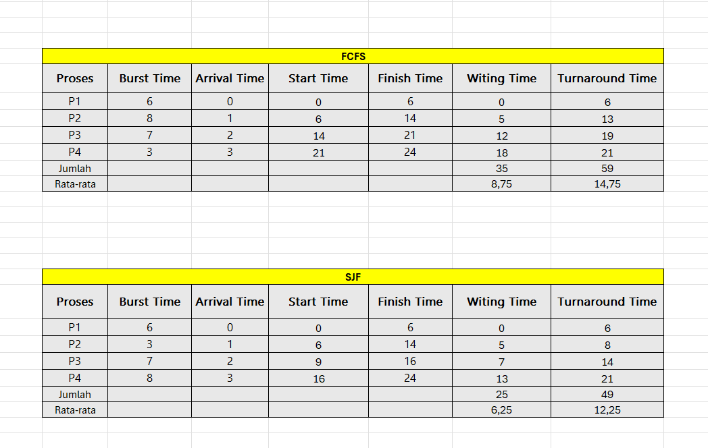

# Laporan Praktikum Minggu 5
Topik: Penjadwalan CPU – FCFS dan SJF

---

## Identitas
- **Nama**  : April Triadi
- **NIM**   : 250202930
- **Kelas** : 1IKRB

---

## Tujuan
Setelah menyelesaikan tugas ini, mahasiswa mampu:

1. Menghitung waiting time dan turnaround time untuk algoritma FCFS dan SJF.
2. Menyajikan hasil perhitungan dalam tabel yang rapi dan mudah dibaca.
3. Membandingkan performa FCFS dan SJF berdasarkan hasil analisis.
4. Menjelaskan kelebihan dan kekurangan masing-masing algoritma.
4. Menyimpulkan kapan algoritma FCFS atau SJF lebih sesuai digunakan.
   
---

## Dasar Teori
Pada praktikum minggu ini, mahasiswa akan mempelajari **algoritma penjadwalan CPU (CPU Scheduling)** menggunakan dua pendekatan dasar:  
- **FCFS (First Come First Served)**  
- **SJF (Shortest Job First)**  

Tujuan utamanya adalah memahami bagaimana sistem operasi menentukan urutan eksekusi proses, serta bagaimana *waiting time* dan *turnaround time* memengaruhi performa sistem.

Mahasiswa akan melakukan simulasi dan perbandingan hasil perhitungan kedua algoritma ini menggunakan **tabel observasi manual atau spreadsheet (Excel/Google Sheets)** — tanpa perlu melakukan instalasi atau pemrograman tambahan.

---

## Langkah Praktikum
1. **Siapkan Data Proses**
   Gunakan tabel proses berikut sebagai contoh (boleh dimodifikasi dengan data baru):
   | Proses | Burst Time | Arrival Time |
   |:--:|:--:|:--:|
   | P1 | 6 | 0 |
   | P2 | 8 | 1 |
   | P3 | 7 | 2 |
   | P4 | 3 | 3 |

2. **Eksperimen 1 – FCFS (First Come First Served)**
   - Urutkan proses berdasarkan *Arrival Time*.  
   - Hitung nilai berikut untuk tiap proses:
     ```
     Waiting Time (WT) = waktu mulai eksekusi - Arrival Time
     Turnaround Time (TAT) = WT + Burst Time
     ```
   - Hitung rata-rata Waiting Time dan Turnaround Time.  
   - Buat Gantt Chart sederhana:  
     ```
     | P1 | P2 | P3 | P4 |
     0    6    14   21   24
     ```

3. **Eksperimen 2 – SJF (Shortest Job First)**
   - Urutkan proses berdasarkan *Burst Time* terpendek (dengan memperhatikan waktu kedatangan).  
   - Lakukan perhitungan WT dan TAT seperti langkah sebelumnya.  
   - Bandingkan hasil FCFS dan SJF pada tabel berikut:

     | Algoritma | Avg Waiting Time | Avg Turnaround Time | Kelebihan | Kekurangan |
     |------------|------------------|----------------------|------------|-------------|
     | FCFS | ... | ... | Sederhana dan mudah diterapkan | Tidak efisien untuk proses panjang |
     | SJF | ... | ... | Optimal untuk job pendek | Menyebabkan *starvation* pada job panjang |

4. **Eksperimen 3 – Visualisasi Spreadsheet (Opsional)**
   - Gunakan Excel/Google Sheets untuk membuat perhitungan otomatis:
     - Kolom: Arrival, Burst, Start, Waiting, Turnaround, Finish.
     - Gunakan formula dasar penjumlahan/subtraksi.
   - Screenshot hasil perhitungan dan simpan di:
     ```
     praktikum/week5-scheduling-fcfs-sjf/screenshots/
     ```

5. **Analisis**
   - Bandingkan hasil rata-rata WT dan TAT antara FCFS & SJF.  
   - Jelaskan kondisi kapan SJF lebih unggul dari FCFS dan sebaliknya.  
   - Tambahkan kesimpulan singkat di akhir laporan.

6. **Commit & Push**
   ```bash
   git add .
   git commit -m "Minggu 5 - CPU Scheduling FCFS & SJF"
   git push origin main
   ```

---

## Kode / Perintah
Tuliskan potongan kode atau perintah utama:
```
Waiting Time (WT) = waktu mulai eksekusi - Arrival Time
Turnaround Time (TAT) = WT + Burst Time
```


## Hasil Eksekusi
Sertakan screenshot hasil percobaan atau diagram:


| Algoritma | Avg Waiting Time | Avg Turnaround Time | Kelebihan | Kekurangan |
|------------|------------------|----------------------|------------|-------------|
| FCFS | 8,75 | 14,75 | Sederhana dan mudah diterapkan | Tidak efisien untuk proses panjang |
| SJF | 6,25 |12,25  | Optimal untuk job pendek | Menyebabkan *starvation* pada job panjang |
---

## Analisis
1. Perbandingan Rata-rata Waktu Tunggu (WT) dan Turnaround Time (TAT) antara FCFS dan SJF:
- FCFS (First Come First Serve) melayani proses berdasarkan urutan kedatangan. Hal ini cenderung menghasilkan waktu tunggu dan turnaround time yang lebih tinggi jika terdapat proses dengan durasi panjang di awal antrian, karena proses singkat harus menunggu proses panjang selesai terlebih dahulu. Akibatnya, rata-rata WT dan TAT cenderung lebih besar dan tidak optimal.
- SJF (Shortest Job First) memprioritaskan proses dengan durasi eksekusi terpendek terlebih dahulu. Karena itu, proses-proses pendek selesai lebih cepat tanpa terganggu oleh proses lama, yang menyebabkan rata-rata WT dan TAT menjadi lebih kecil dan optimal dibanding FCFS.
2. Kondisi Kapan SJF Lebih Unggul dari FCFS dan Sebaliknya:
  - SJF lebih unggul ketika durasi proses sangat bervariasi dan durasi proses dapat diprediksi dengan baik. Dalam kondisi ini, SJF meminimalkan waktu tunggu rata-rata dan turnaround time, sehingga efisiensi penjadwalan meningkat.
  - FCFS lebih unggul atau lebih cocok pada sistem yang memerlukan fairness dan kesederhanaan tanpa memerlukan prediksi waktu proses, seperti pada sistem batch yang prosesnya relatif homogen atau pada kasus ketika semua proses memiliki durasi yang hampir sama.
  - SJF kurang cocok pada sistem interaktif atau real-time yang memerlukan respons cepat dan adil karena memungkinkan proses panjang mengalami starvation, sedangkan FCFS memberikan perlakuan adil berdasarkan urutan kedatangan.

---

## Kesimpulan
 SJF cenderung memberikan hasil rata-rata waktu tunggu dan turnaround time yang lebih kecil dibanding FCFS karena memprioritaskan proses dengan durasi terpendek terlebih dahulu, sehingga meningkatkan efisiensi. Namun, FCFS lebih sederhana dan adil dalam penjadwalan proses yang datang secara berurutan tanpa memerlukan prediksi durasi. Pemilihan algoritma terbaik bergantung pada karakteristik dan kebutuhan sistem yang digunakan.

---

## Quiz
1. Apa perbedaan utama antara FCFS dan SJF?

FCFS mengutamakan urutan kedatangan proses, sedangkan SJF mengutamakan durasi proses terpendek untuk dieksekusi terlebih dahulu
   
2. Mengapa SJF dapat menghasilkan rata-rata waktu tunggu minimum?

Perbedaan utama antara FCFS (First Come First Serve) dan SJF (Shortest Job First) terletak pada cara penjadwalan proses dilaksanakan. FCFS menjalankan proses berdasarkan urutan kedatangan tanpa memedulikan lama waktu proses (burst time) proses yang datang lebih dulu dilayani lebih dulu hingga selesai. Sementara itu, SJF menjalankan proses yang memiliki waktu eksekusi terpendek terlebih dahulu, sehingga dapat meminimalkan waktu tunggu rata-rata proses.

3. Apa kelemahan SJF jika diterapkan pada sistem interaktif

Kelemahan utama SJF jika diterapkan pada sistem interaktif adalah risiko terjadinya starvation (kelaparan proses). Hal ini terjadi karena SJF selalu memprioritaskan proses dengan waktu eksekusi terpendek, sehingga proses yang membutuhkan waktu lebih lama bisa terus-menerus didelay atau ditunda jika selalu ada proses singkat baru yang masuk

---

## Refleksi Diri
Tuliskan secara singkat:
- Apa bagian yang paling menantang minggu ini?  
- Bagaimana cara Anda mengatasinya?  

---

**Credit:**  
_Template laporan praktikum Sistem Operasi (SO-202501) – Universitas Putra Bangsa_
